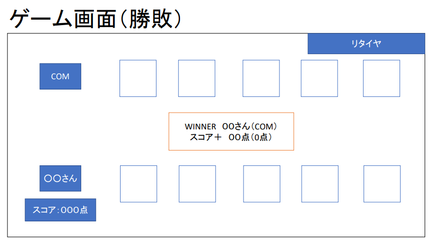

# オブジェクト指向プログラミングおよび演習 第12回進捗レポート

## 作成者
| 氏名           | 学籍番号    |
| -------------- | ----------- |
| 岩間　佑都　     | k19013　     |
| 外山　瑠起　     | k19074　     |
| 西澤　侑   | k19081　     |
| 馬場  富雅    | k19086　     |
| 馬場　健輔     | k19094　     |

## 仕様
- flaskを使ったゲーム

#追記：　相手（COM）のカードの交換はなし、交換しないボタンの追加、次へボタンを追加

- css、画面を遷移できる（担当：堀田）
- Webとpythonでのスコアやハンドのやり取り（主担当：外山，副担当：岩間）
- python　17ポーカーで、ハンドを配る、交換する、判定してスコア返す（主担当：馬場，副担当：西澤）

- アプリ完成イメージ
    
    
    
    ＃追記　交換しない（勝負ボタン）
    
    ＃追記　次へ（次へボタン）
    
    

## 作業報告
- Web―Python間でやり取りするデータについて話し合った（メンバー：岩間、外山、馬場、西澤）
詳細：

&emsp;&emsp;&emsp;1.Web側　スタートボタンのイベント　Python側　残り山札、COMの手札、プレイヤーの手札を返す

&emsp;&emsp;&emsp;2.Web側　残り山札、プレイヤーの手札、交換するカードが何番目かを返す　Python側　プレイヤーの手札を返す

&emsp;&emsp;&emsp;3.Web側　プレイヤーの手札、COMの手札を返す　Python側　プレイヤーの役、勝敗、得点を返す

&emsp;&emsp;&emsp;4.Web側　得点を合算、ゲーム終了後ランキングに乗る場合JSONを書き換え

- JSONファイルの作成（メンバー：外山）
    - マージ済み

- ポーカーのスクリプトを参考に17ポーカーを作成（メンバー：馬場、西澤）
    - マージ済み
    - 課題：Web.pyから与えられる引数や、返す値を考えてものに書き換えが必要

- ホーム画面の作成（メンバー：堀田）
    - マージ済み
    - 課題：プレイ画面の作成、遷移

## 振り返り（感想など）
- 画面の遷移やPythonの実行などで、イベントハンドラなどのjsも必要である。
