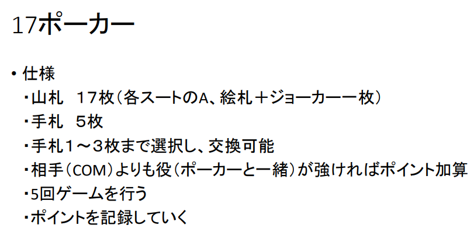
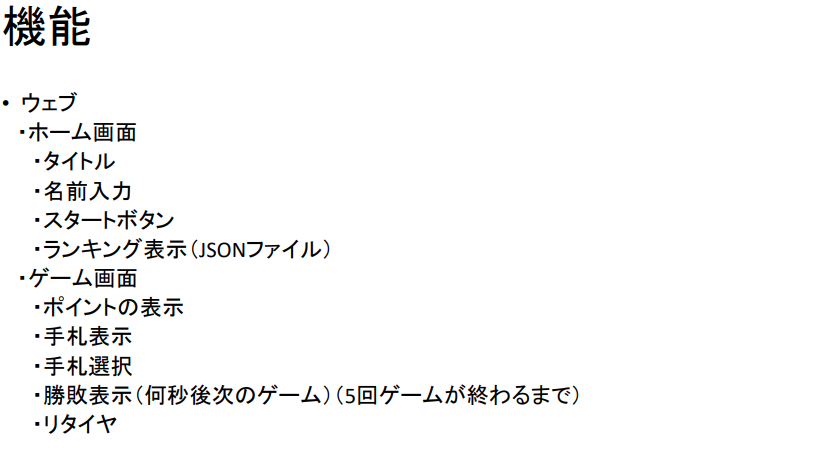
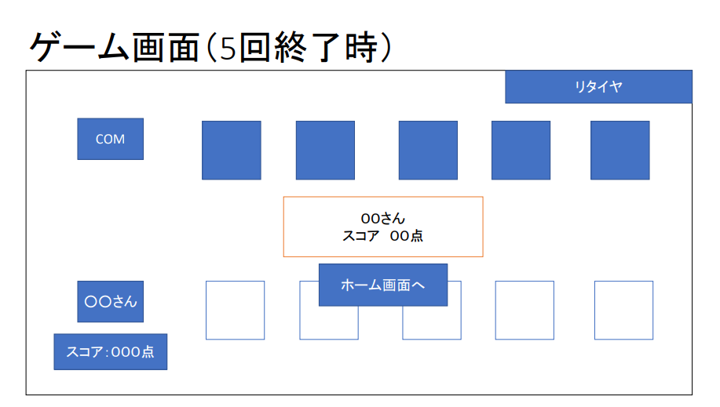

# オブジェクト指向プログラミングおよび演習 第 12 回進捗レポート

## 作成者

| 氏名         | 学籍番号  |
| ------------ | --------- |
| 岩間　佑都　 | k19013 　 |
| 外山　瑠起　 | k19074 　 |
| 西澤　侑     | k19081 　 |
| 馬場 健輔    | k19086 　 |
| 堀田　富雅   | k19094 　 |

## 追加モジュール

| モジュール名 | version  |
| ------------ | -------- |
| pandas 　    | 1.1.5 　 |

## 実行方法

- Web.py を起動し、ローカルホストhttp://127.0.0.1:5000/にアクセス
  　その後処理、遷移の内容は仕様を参照

## 仕様

- flask を使ったゲーム

 #追記：　交換しないボタン（勝負ボタン）の追加、次へボタンを追加

- html、css、画面を遷移できる（担当：堀田）
- Web と python でのスコアやハンドのやり取り（主担当：外山，副担当：岩間）
- python 　 17 ポーカーの、ハンドを配る、交換する、判定してスコア返す（主担当：馬場，副担当：西澤）

- アプリ完成イメージ
  
  
  
  ＃追記　交換しない（勝負ボタン）
  
  ＃追記　次へ（次へボタン）
  

## 作業報告

### 12 月 10 日

- Web―Python 間でやり取りするデータについて話し合った（メンバー：岩間、外山、馬場、西澤）
  詳細：

&emsp;&emsp;&emsp;1.Web 側　スタートボタンのイベント　 Python 側　残り山札、COM の手札、プレイヤーの手札を返す

&emsp;&emsp;&emsp;2.Web 側　プレイヤーの手札、COM の手札、交換するカードが何番目かを返す　 Python 側　プレイヤーの手札を返す、COM の手札を返す

&emsp;&emsp;&emsp;3.Web 側　プレイヤーの手札、COM の手札を返す　 Python 側　勝敗、勝利側の得点を返す

&emsp;&emsp;&emsp;4.Web 側　得点を合算、ゲーム終了後ランキングに乗る場合 JSON を書き換え

- JSON ファイルの作成（メンバー：外山）

  - マージ済み

- ポーカーのスクリプトを参考に 17 ポーカーを作成（メンバー：馬場、西澤）

  - マージ済み
  - 課題：Web.py から与えられる引数や、返す値を考えたものに書き換えが必要

- ホーム画面の作成（メンバー：堀田）
  - マージ済み
  - 課題：ゲーム画面の作成、遷移

### 12 月 11 日

- js を用いたランキングの表示（ソートを含め）（メンバー：外山）

  - マージ済み

- カードの交換（class ChangeHand： receive_my_hand(self, プレイヤーの手札のリスト, 残り山札のリスト ,何枚目を交換するか,何枚目を交換するか(or None),何枚目を交換するか(or None)))（メンバー：馬場）

  - マージ済み
  - return [交換後のプレイヤーの手札]

- カードを配る（class TrumpGame： reset_draw_cards()）（メンバー：馬場）

  - マージ済み
  - return [プレイヤーの手札,COM の手札,残りの山札]

- プレイ画面の作成（メンバー：堀田）

  - 未マージ

- 役の評価（メンバー：西澤）

  - 未マージ

- カードを配るのリストが返って、それを Web に反映（メンバー：外山）
  - 未マージ

### 12 月 16 日

- Poker.py の添削（他スクリプトと被っている部分）（メンバー：岩間）
  - マージ済み
- カードを配るを Web に反映（メンバー：外山）
  - マージ済み
- 役の評価（class CompareHand： check_poker_hand(self, 手札のリスト))（メンバー：西澤）
  - マージ済み
  - return [役の点数]

### 12 月 17 日

- カード選択のための html、css、js（メンバー：堀田）
  - 未マージ
- 勝負ボタンを押した場合の処理を Web に反映（メンバー：外山）
  - 未マージ
  - 課題　スクレイピングではカードを配る処理が再びされて、正しいカードの情報が取得できないため、プレイヤーと COM のカードの情報（合計 10 個）をパラメータで渡す方法で進める
- 役が同じだった時の評価（class CompareHand： check_high_number(self, 手札のリスト, 点数))（メンバー：西澤）

  - マージ済み
  - return [役の中で一番強いカードに対応した数字（強いカードは数字が小さい）]
  - 課題　スートでの評価はまだできない。

- カードを配る処理の微調整（メンバー：馬場）

  - マージ済み
  - 引数で渡す値を統一した

- ルール説明の html、css（メンバー：馬場）
  - 未マージ

### 12 月 18 日

- カード選択のための html、css、js（メンバー：堀田）
  - マージ済み

### 12 月 19 日

- 役が同じだった時の評価（class CompareHand： judge_hand(self, player 手札のリスト, com 手札のリスト))（メンバー：西澤、岩間）
  - マージ済み
  - return [勝ち（プレイヤーか COM）,得点]
  - キック＋スートも対応

### 12 月 21 日

- 役の得点を Web に表示（メンバー：外山）
  - プルリク中
  - 大きなコンフリクトのため未マージ

### 12 月 23 日

- 配るカードを整列、役評価の変数間違いの直し、カード交換の引数の微調整と COM のカード交換の実現（カード交換　 class ChangeHand:change_cards(self,player の手札のリスト,COM の手札のリスト,player が交換する n 枚目,player が交換する n 枚目,player が交換する n 枚目)、COM のカードの交換は下記のメモを memo）（メンバー：岩間、西澤、馬場）

  - マージ済み
  - return [交換済みのプレイヤーの手札,交換済みの COM の手札]

- 勝負ボタンを押した際、役の得点を Web に表示（メンバー：外山）
  - マージ済み

### 12 月 24 日

- 勝負ボタンを押した際、相手の手札を Web に表示（メンバー：外山、岩間）
  　 - マージ済み

- 交換するカード選択後、交換ボタンを押した際、交換した手札を Web に表示（メンバー：外山）
  　 - マージ済み

- スコア表示の css 修正、js でリセットのための関数を用意（メンバー：堀田）
  　 - マージ済み
  　　- 課題：リセットを用いて、5 回ゲームを繰り返す処理を外山と相談の上、実装

## 振り返り（感想など）

- 実装できたこととしてスコアの表示と交換後の画像の変更があげられる。python 側でスクライピングで処理を試みたがデータの受け渡しの構造上データが切り替わるため js による処理に変更した。また js 同士が競合して class を変更していたため上手く動かなかったがそれを解決。プルリクを出してから confilic の解消に日数を開けてしまったのでもっと早く話し合って解決すべきだった。現在スコアの反映とカード交換の結果が表示できているので五回のゲームをする際にスコアを記録しながら足しあわせる処理とランキング表示を実装できるようにしたい。

## memo

- 0 : Joker
  　 1: (それぞれのマーク)A
  　 2: (それぞれのマーク)K
  　 3: (それぞれのマーク)Q
  　 4: (それぞれのマーク)J

- ファイブカード（800 点）：4 枚同じ数字＋ Joker
- ロイヤルストレートフラッシュ（700 点）：4 枚違う数字＋すべて同じマーク＋ Joker
- フォーカード（600 点）：4 枚同じ数字（3 枚同じ数字＋ Joker）
- フルハウス（500 点）：2 枚同じ数字＋ 3 枚同じ数字（ツーペア＋ Joker）
- ストレート（400 点）：4 枚違う数字＋ Joker
- スリーカード（300 点）：3 枚同じ数字（ワンペア＋ Joker）
- ツーペア（200 点）：2 枚同じ数字＋他 2 枚同じ数字
- ワンペア（100 点）：2 枚同じ数字

- 数字の小さい順に手札リストをソート（Joker（0）が含まれる場合、それ以外で役を評価する）

- キック　（役が同じな場合、役と関係ないカードで一番強いカードを持っているプレイヤーの勝ち（＋スートを含めて））

- COM の交換に関する思考ルーチン
  - ストレート（400 点）以下の時に交換
  - ツーペアの場合　ユニークな残り 1 枚を交換
  - ワンペアの場合　ユニークな 3 枚の内、強いカード一枚（Joker があれば Joker）を残して交換
  - スリーカードの場合　ユニークな 2 枚すべてを交換
